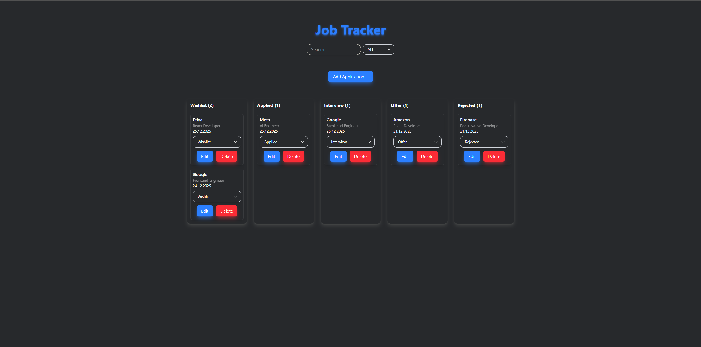
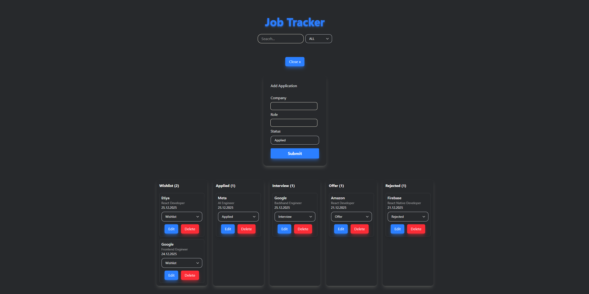
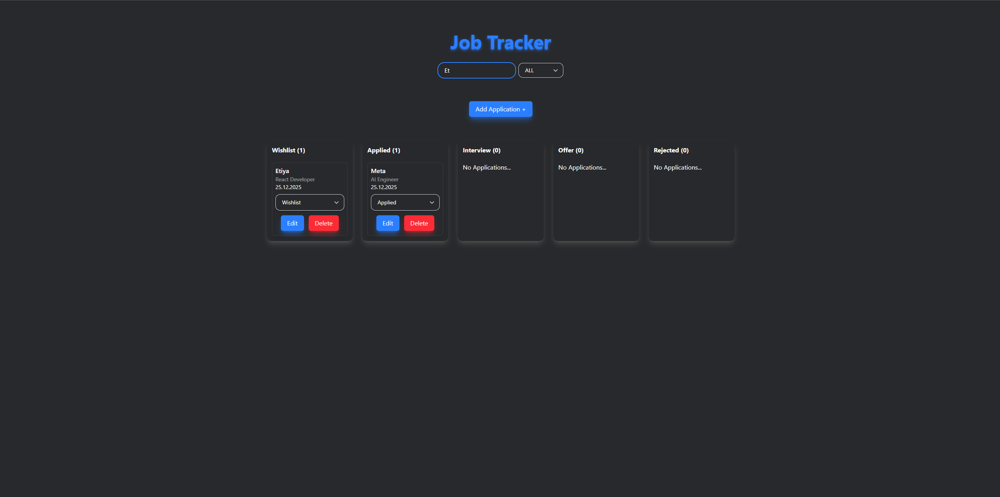

# 🧭 Job Tracker – React Kanban Application

A modern, lightweight **job application tracking** app built with **React + TypeScript**.  
It helps you manage your job search using a **Kanban-style board**, with full CRUD support, filtering, and persistent storage.

> Built as a hands-on React practice project to demonstrate real-world state management, UI patterns, and TypeScript usage.

---

## ✨ Features

- 🗂️ **Kanban Board**
  - Wishlist / Applied / Interview / Offer / Rejected columns
- ➕ **Add Application**
  - Modal-based form with controlled inputs
- ✏️ **Edit Application**
  - Reuse the same modal for editing existing entries
- 🗑️ **Delete Application**
- 🔄 **Move Between Columns**
  - Change status via dropdown, card moves instantly
- 🔍 **Search & Filter**
  - Search by company or role
  - Filter by application status
- 💾 **Persistent Storage**
  - Data is saved to `localStorage`
- 🎨 **Modern UI**
  - Custom styled selects, modal, clean layout
- 🔐 **Type-safe**
  - Strongly typed with TypeScript

---

## 🖼️ Screenshots

### Board View


### Add / Edit Modal


### Search & Filter


---

## 🛠️ Tech Stack

- **React**
- **TypeScript**
- **Vite**
- **Tailwind CSS**
- **LocalStorage API**

---

## 🧠 What This Project Demonstrates

This project was built to practice and demonstrate:

- React component architecture
- `useState`, `useEffect` and immutable state updates
- Controlled forms and modal patterns
- Reusable logic for **Add / Edit / Delete**
- Array operations (`map`, `filter`) for UI rendering
- TypeScript union types and strict typing
- Clean UI/UX without external component libraries

---

## 🚀 Getting Started

```bash
# clone the repository
git clone https://github.com/MehmetHooke/job-tracker.git

# install dependencies
npm install

# start development server
npm run dev
